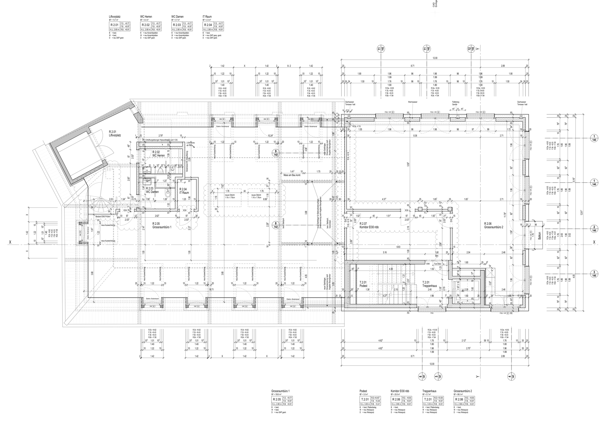
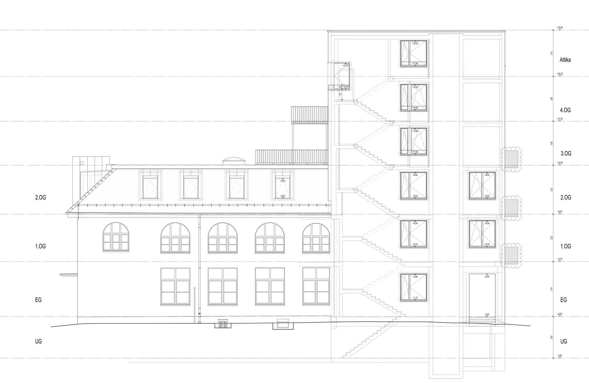
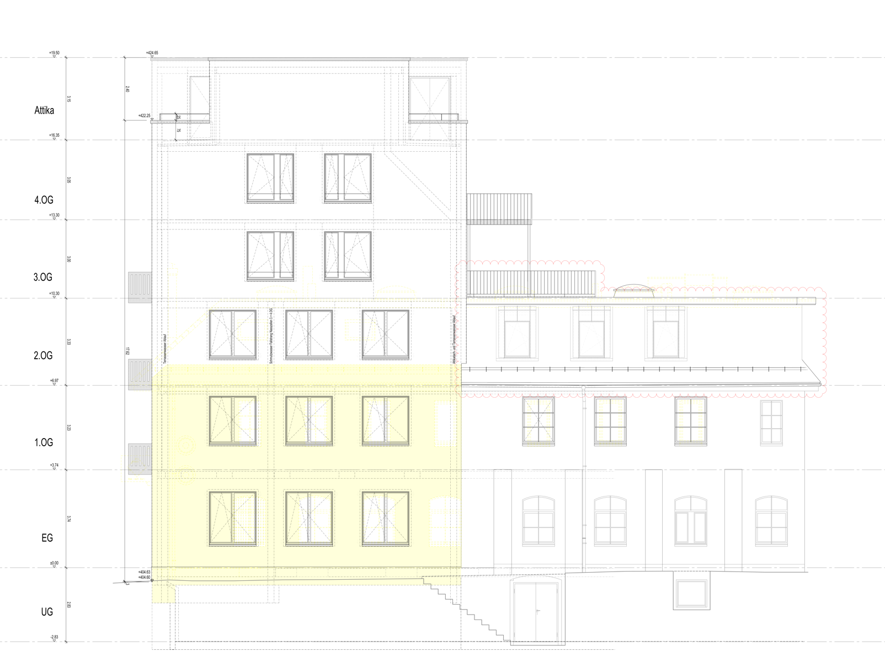
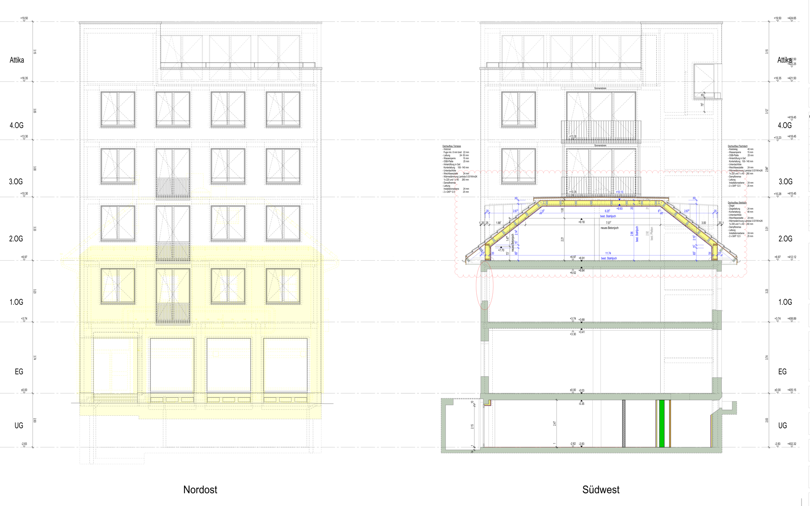

# Limmatstrasse 183, Zürich 5

we’re subletting the 2nd floor at our new office location starting in May 2014.

It's at Limmatstrasse 183, Kreis 5, between Limmatplatz and
Escher-Wyss-Platz right before the Viaduct and very near to tram stop Quellenstrasse.

* Streetview: [http://liip.to/L183Streetview](http://liip.to/L183Streetview)
* MapView: [http://liip.to/L183MapView](http://liip.to/L183MapView)
* Homegate Ad: [http://liip.to/L183Homegate](http://liip.to/L183Homegate)

It's the old Radio 24 building, but they are currently totally
renovating it, it will look very different from what you see on streetview.

We will have the whole building for us alone (except the 3 flats they are building on top), in total 4 floors. A basement where we want to build the arena in one part (there's also natural light there) for events like Webtuesday, Teammeetings and more. The ground floor with kitchen, three meeting rooms and more space for working desks and the 1st and 2nd floor. All in all 1050 m2.

There will also be a shower and the Limmat is nearby for some jogging or swimming.

The plan is to move in some time after the 1st of April.

## Getting there

### Public Transport

There are 3 tram lines (4, 13, 17) going to Quellenstrasse and it's only
approx. 3-4 tram stops from the HB (depending on where you get in), you
should also be way faster at our new location than before (4 minutes vs.
11 minutes by public transport, counted from the back stairs). By foot
it's also 200m closer (according to Google ;)).

Limmatplatz with bus line #32 is also very nearby.

### Car

There's a public parking deck nearby for car parking.

### Bike

There will also be parking spaces for bikes directly at the building.

## Subletting the 2nd floor

We want to sublet the top floor as we don't need that much space right now (but maybe later). If you're interested in that, get in contact with me [chregu@liip.ch](mailto:chregu@liip.ch?subject=Limmatstrasse%20183) and we can talk about conditions and prices.

## Outside pictures

